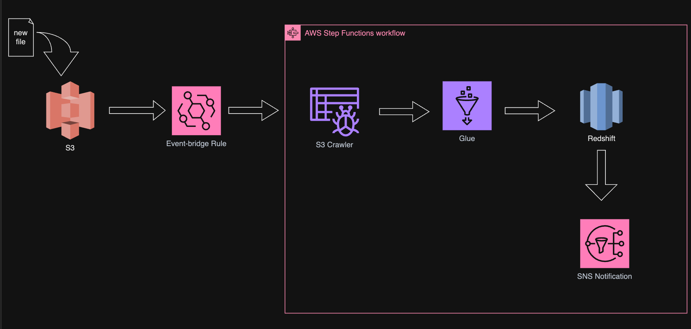

# Flight Data Pipeline Automation

Airlines and aviation data providers require an efficient and automated system to handle the daily influx of flight data for analysis and reporting purposes. The goal is to develop a scalable and reliable data pipeline on AWS that automates the ingestion, processing, and storage of flight data. The solution should ensure timely updates, maintain data integrity, and provide stakeholders with immediate notifications on the status of data processing tasks. This will enable better decision-making, enhance operational efficiency, and reduce the overhead associated with manual data handling.


## Tables in Redshift

'airlines.airports_dim' 
columns : airport_id, city, state, name

'airlines.daily_flights_fact'
columns : carrier, dep_airport, arr_airport, dep_city, arr_city, dep_state, arr_state, dep_delay, arr_delay


## incoming data in S3

CSV file with columns Carrier, OriginAirportID, DestAirportID, DepDelay, ArrDelay

CSV file will be placed in the S3 bucket with hive style partition as shown below.

```
deepakreddy@Deepaks-MacBook-Pro ~ % aws s3 ls airlines-data-landing/daily-flights/
                           PRE date=20240810/
                           PRE date=20240811/
2024-07-23 10:45:37          0 
```


## Solution Architecture

The architecture of the Flight Data Pipeline Automation project leverages several AWS services to create a seamless, automated workflow for ingesting, processing, and storing flight data. Below is a detailed explanation of the architecture:



1. Data Ingestion:
    Amazon S3: Flight data in CSV format is uploaded to an S3 bucket. The data is organized using Hive-style partitioning 
    (e.g., s3://flight-data/year=2024/month=07/day=23/).

2. Event Triggering:
    Amazon EventBridge: An EventBridge rule monitors the S3 bucket for the addition of new CSV files. When a new file is detected, it triggers the workflow.

3. Workflow Orchestration

    - AWS Step Functions: Manages the sequential execution of tasks. The workflow consists of several steps:
    - Start Glue Crawler: Initiates a Glue Crawler to update the data catalog of the S3 data.
    - Wait for Crawler Completion: Waits until the Glue Crawler completes its task.
    - Trigger Glue Job: Initiates a Glue Job to process the data.
    - Check Job Status: Monitors the Glue Job status.
    - Send Notification: Sends success or failure notifications using SNS.

4. Data Cataloging
    Data Catalog is created for the S3 data and also for dim and fact tables in Redshift. The crawler that is run with the workflow is only for the S3 data.
    AWS Glue Crawler: Scans the S3 bucket and updates the AWS Glue Data Catalog with the schema information of the new data.

5. Data Processing:
    AWS Glue Job: A Glue ETL (Extract, Transform, Load) job processes the ingested flight data. This involves:
    - Reading the data from S3 and from the dim table in Redshift.
    - Filtered flights with more than 20 mins departure delay and performed join operation on the two datasets.
    - Adjust the schema of the resulting dataframe to match with the fact table in Redshift
    - Writing the transformed data to the fact table in Amazon Redshift.
    - Enabled job bookmarking to process only new files.

6. Data Storage:
    Amazon Redshift: Stores the processed data in a fact table. Redshift is optimized for complex queries and analytics, making it ideal for handling large datasets.

7. Monitoring and Notifications:
    - Amazon SNS: Sends email notifications to stakeholders. Notifications are sent upon:
    - Successful completion of the Glue Job.
    - Failure of any step in the process, enabling quick troubleshooting and response.
